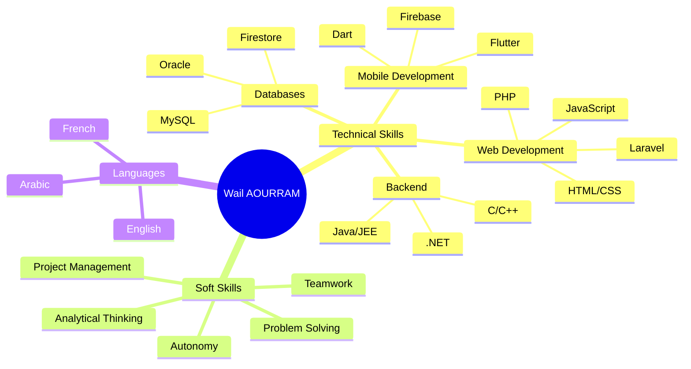

<div align="center">

# 🌊 WAIL AOURRAM


<p>
  
  
  
  
</p>

```ascii
╔══════════════════════════════════════════════════════════════╗
║  DUT Graduate in Web & Mobile Development | EST Nador       ║
║  Passionate about building innovative digital solutions     ║
╚══════════════════════════════════════════════════════════════╝
```

</div>

---

<div align="center">

## 🎯 ABOUT ME

</div>

```typescript
const wailAourram = {
    location: "Tétouan, Morocco 🇲🇦",
    education: "DUT in Web & Mobile Development",
    institution: "EST Nador - Université Mohammed Premier",
    graduation: "2023 - 2025",
    
    currentFocus: [
        "Building scalable web applications",
        "Mobile app development with Flutter",
        "Learning new technologies",
        "Contributing to open source"
    ],
    
    lifePhilosophy: "Code with passion, build with purpose 🚀",
    
    ambition: "Creating digital solutions that make a real impact"
};
```

---

<div align="center">

## ⚡ TECH STACK

</div>

<div align="center">

### 🎨 Frontend Development


### 📱 Mobile Development


### 💻 Backend & Languages


### 🗄️ Databases


### 🛠️ Tools & Technologies


</div>

---

<div align="center">

## 💼 PROFESSIONAL EXPERIENCE

</div>

<table>
<tr>
<td width="50%">

### 🌐 Web Development Intern
**Drâa-Tafilalet Region** | *July-August 2024*

- 🎨 Designed complete institutional website with WordPress
- ⚡ Advanced theme customization & custom solutions
- 📈 SEO optimization & natural referencing strategies
- 🔧 Interactive systems integration (forms, user features)

</td>
<td width="50%">

```javascript
const internship = {
  duration: "2 months",
  technologies: [
    "WordPress",
    "PHP",
    "SEO",
    "Web Design"
  ],
  achievements: [
    "Full website deployment",
    "Custom theme development",
    "SEO optimization"
  ]
};
```

</td>
</tr>
</table>

---

<div align="center">

## 🚀 FEATURED PROJECTS

</div>

<details open>
<summary><b>📱 AZ FITNESS - Mobile Application (2025)</b></summary>

<br>

**Final Year Project** | `Flutter` `Firebase` `Dart`

```yaml
Description: Comprehensive fitness platform connecting users with gyms
Features:
  - 📍 Geolocation system for nearby gyms
  - 📱 QR Code attendance management
  - 💪 Personalized training programs
  - 🥗 Nutritional advice and meal plans
  - 👥 Social community features
  - 📊 Progress tracking and analytics
```

**Tech Stack:** Flutter • Firebase • Cloud Firestore • Google Maps API

</details>

<details>
<summary><b>🍕 Pizza Restaurant Management (2024)</b></summary>

<br>

**Web Application** | `Laravel` `PHP` `MySQL`

```yaml
Description: Complete management system for pizza restaurant
Features:
  - 🛒 Online ordering interface
  - 📋 Menu & inventory management
  - 🚚 Delivery tracking system
  - 🔐 User authentication & profiles
  - 📊 Admin dashboard
```

**Tech Stack:** Laravel • PHP • MySQL • Bootstrap

</details>

<details>
<summary><b>🏨 Hotel Booking Application (2024)</b></summary>

<br>

**Desktop Application** | `Java` `JEE`

```yaml
Description: Hotel reservation management system
Features:
  - 🔑 Secure authentication system
  - 📅 Room availability management
  - 💰 Dynamic pricing system
  - 👨‍💼 Admin interface for operations
  - 📊 Booking analytics
```

**Tech Stack:** Java • JEE • MySQL • Swing

</details>

---

<div align="center">

## 📊 GITHUB STATS


</div>

---

<div align="center">

## 🎓 EDUCATION

</div>

<table>
<tr>
<td width="50%">

### 🎓 DUT in Web & Mobile Development
**EST Nador - Université Mohammed Premier**
📅 2023 - 2025

**Specialization:** Web & Mobile Application Development

**Key Courses:**
- Mobile Development (Flutter, Dart)
- Web Development (Laravel, PHP)
- Database Management (SQL, Oracle)
- Software Engineering (Java, JEE)
- Agile Methodologies

</td>
<td width="50%">

### 🏫 Baccalauréat Sciences Physiques
**Lycée Driss Ben Zekri**
📅 2019 - 2021

**Option:** Français

**Achievement:** Successfully completed with focus on scientific subjects

</td>
</tr>
</table>

---

<div align="center">

## 💡 SKILLS & COMPETENCIES

</div>



---

<div align="center">

## 🌍 LANGUAGES

</div>

<div align="center">

| Language | Proficiency |
|----------|------------|
| 🇫🇷 **French** | ████████░░ 80% |
| 🇬🇧 **English** | ███████░░░ 70% |
| 🇲🇦 **Arabic** | ██████████ 100% |

</div>

---

<div align="center">

## 📫 LET'S CONNECT

</div>

<div align="center">

[](https://linkedin.com/in/wail-aourram)
[](mailto:wail.aourram.23@ump.ac.ma)
[](https://github.com/wailaourram)
[](https://wailaourram.github.io)

<br>

**📍 Based in Tétouan, Morocco**


</div>

---

<div align="center">

## 🎯 CURRENT GOALS

</div>

- 🔭 Currently working on innovative mobile applications
- 🌱 Learning advanced Flutter & Firebase techniques
- 👯 Looking to collaborate on open source projects
- 💼 Seeking opportunities in software development
- ⚡ Building my portfolio with real-world projects

---

<div align="center">

## 🏆 ACHIEVEMENTS & CERTIFICATIONS

</div>

```diff
+ 🎓 DUT Laureate in Web & Mobile Development (EST Nador)
+ 💼 Successful Web Development Internship (Drâa-Tafilalet Region)
+ 📱 Developed complete mobile application (AZ FITNESS)
+ 🌐 Created professional institutional website with WordPress
+ 🎯 Mastered multiple programming languages and frameworks
```

---

<div align="center">

## 💭 QUOTE

</div>

<div align="center">

```
╔════════════════════════════════════════════════════════════╗
║                                                            ║
║  "The only way to do great work is to love what you do"   ║
║                                                            ║
║                               - Steve Jobs                 ║
║                                                            ║
╚════════════════════════════════════════════════════════════╝
```

</div>

---

<div align="center">

### ⚡ Fun Facts

🎮 Gaming enthusiast | 🎵 Music lover | 📚 Continuous learner | ☕ Coffee addict

</div>

---

<div align="center">


### 🌟 Thanks for visiting! Let's build something amazing together! 🚀

</div>
